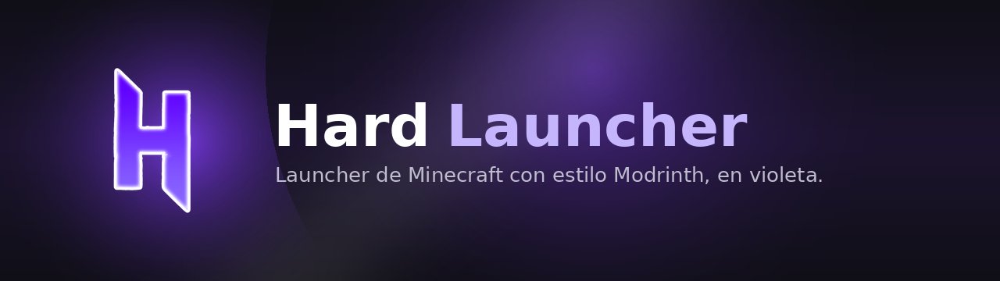

<div align="center">



[](https://github.com/whoishard/hardlauncher/releases/latest)
[](https://github.com/whoishard/hardlauncher/releases)
[](https://github.com/whoishard/hardlauncher/releases/latest)
[](https://www.electronjs.org/)

**Launcher de Minecraft para cuentas premium y no premium.**
Cuentas Offline y Microsoft, mods/modpacks/resource packs/shaders,
gestión de instancias, y actualizaciones automáticas. Basado en Modrinth.

[**⬇️ Descargar la última versión**](https://github.com/whoishard/hardlauncher/releases/latest)
&nbsp;·&nbsp;
[Reportar un problema](https://github.com/whoishard/hardlauncher/issues)

</div>

<br />

## ✨ Qué incluye

- 🟣 **Cuentas Offline y Microsoft (Premium)** — mismo flujo de lanzamiento
  para las dos, sin ramas de código separadas.
- 📦 **Explorador de contenido** — mods, resource packs, shaders,
  modpacks y data packs, con filtros, buscador y progreso de instalación por
  ítem (sin saltos raros de layout al instalar varios seguidos).
- 🗂️ **Gestión de instancias** — múltiples versiones/loaders (Fabric, Quilt,
  Forge, NeoForge) en paralelo, cada una con su propia config de Java,
  memoria, resolución y hooks de lanzamiento.
- 🎨 **Editor de íconos** para cada instancia, con estudio de colores/formas
  o imagen propia.
- 🌐 **Multi-idioma** — español, inglés y portugués.
- 🔄 **Auto-actualización** — al publicar una versión nueva, todos los que
  ya tienen el launcher instalado la reciben solos, sin reinstalar nada a
  mano.
- 🖥️ **Consola en vivo** de cada partida, con copiar/limpiar logs.

<!--
  Agregá acá una o dos capturas de pantalla reales del launcher cuando
  quieras — por ejemplo:

  <p align="center">
    
  </p>
-->

## 🚀 Instalación (para jugadores)

1. Andá a [**Releases**](https://github.com/whoishard/hardlauncher/releases/latest)
   y descargá el `.exe` más reciente.
2. Ejecutalo. Windows SmartScreen puede avisar "Windows protegió tu PC" (el
   instalador no está firmado digitalmente) — tocá **Más información** →
   **Ejecutar de todas formas**.
3. Listo. Las próximas actualizaciones las vas a recibir solo, adentro del
   launcher.

<br />

<details>
<summary><strong>🛠️ Guía para compilar y correr en desarrollo</strong></summary>

### 1. Requisitos previos
- Node.js 18 o superior
- npm 9+
- Java **no** hace falta tenerlo instalado: el launcher descarga su propio
  runtime por versión de Minecraft.

### 2. Instalar dependencias
```bash
git clone https://github.com/whoishard/hardlauncher.git
cd hardlauncher
npm install
```

### 3. Ejecutar en modo desarrollo
```bash
npm run dev
```
Levanta Vite en `http://localhost:5173` y abre la ventana de Electron
apuntando a ese servidor, con hot-reload.

### 4. Compilar el instalador
```bash
npm run build
```
Genera primero el bundle de React (`dist/`) y después empaqueta con
`electron-builder`, dejando `HardLauncher-Setup-<versión>.exe` en `release/`.

### 5. Publicar una actualización
El repo ya tiene un workflow de GitHub Actions
(`.github/workflows/release.yml`) que compila y publica solo al crear un
tag `vX.Y.Z`. Ver **`PUBLICAR-ACTUALIZACIONES.md`** para el paso a paso.

### 6. Configurar el login Microsoft (solo si se usará modo Premium)
`msmc` gestiona el flujo estándar de "device code"/ventana embebida sin
necesitar que registres una app propia en Azure para uso personal/pruebas.
Para distribución pública a gran escala, Mojang recomienda registrar una
aplicación en el [Azure Portal](https://portal.azure.com) y usar tu propio
`client_id`.

</details>

<details>
<summary><strong>🧱 Stack elegido y por qué</strong></summary>
<br />

| Capa | Tecnología | Motivo |
|---|---|---|
| Shell de escritorio | **Electron** | Acceso completo a Node.js (fs, child_process) necesario para descargar/lanzar Minecraft; multiplataforma; mismo enfoque que launchers reales como GDLauncher. |
| UI | **React + Vite** | Recarga rápida en desarrollo, componentes reutilizables para tarjetas de mods/instancias. |
| Estado global | **Zustand** | Más ligero que Redux para el tamaño de este proyecto. |
| Persistencia local | **electron-store** | Guarda cuentas e instancias en JSON en `userData`, sin necesidad de una base de datos. |
| Auth Premium | **msmc** | Encapsula el flujo completo MSA → Xbox Live → XSTS → Minecraft Services. |
| Descargas | **axios + streams nativos de Node** | Control fino sobre progreso de descarga y verificación SHA1. |
| Auto-actualización | **electron-updater** | Chequea, descarga e instala actualizaciones publicadas como GitHub Releases. |
| Empaquetado | **electron-builder** | Genera el instalador `.exe` (NSIS) con ícono, accesos directos y diseño propio. |

Alternativa evaluada: **Tauri + Rust** — produce binarios más livianos,
pero el ecosistema de librerías para el
protocolo de lanzamiento de Minecraft (Yggdrasil, Fabric Meta, etc.) está
mucho más maduro en Node.js, por lo que Electron acelera el desarrollo.

</details>

<details>
<summary><strong>📁 Estructura del proyecto</strong></summary>
<br />

```
hard-launcher/
├── package.json
├── vite.config.js
├── index.html
├── electron/
│   ├── main.js              # Proceso principal: registra todos los canales IPC
│   ├── preload.js           # Puente seguro contextBridge -> window.hardLauncher
│   └── updater.js           # Lógica de auto-actualización (electron-updater)
├── src/
│   ├── auth/
│   │   ├── offlineAuth.js    # Generación de UUID offline (idéntico algoritmo a Mojang)
│   │   ├── microsoftAuth.js  # OAuth2 Microsoft vía msmc
│   │   └── accountManager.js # Persistencia y cuenta activa
│   ├── core/
│   │   ├── versionManager.js # Manifest Mojang, descarga client.jar/libs/assets
│   │   ├── loaderManager.js  # Fabric/Quilt/Forge/NeoForge
│   │   └── launcher.js       # Construye el comando java y hace spawn()
│   ├── api/
│   │   ├── modrinthApi.js    # Wrapper API v2 de Modrinth (search, versions, etc.)
│   │   └── modInstaller.js   # Instala mods+dependencias, toggles, .mrpack
│   ├── store/
│   │   └── instanceStore.js  # CRUD de instancias en disco
│   └── renderer/
│       ├── main.jsx
│       ├── App.jsx
│       ├── store.js          # Estado global (Zustand)
│       ├── i18n.js           # Traducciones es/en/pt
│       ├── components/
│       └── views/
└── styles/
    └── theme.css              # Paleta morada (#16181c, #a78bfa, #7c3aed)
```

</details>

<details>
<summary><strong>🔐 Cómo funciona la autenticación</strong></summary>
<br />

**No-Premium (Offline):**
1. El usuario ingresa un nickname (3-16 caracteres).
2. `offlineAuth.js` calcula un UUID v3 vía MD5 sobre `OfflinePlayer:<nick>` —
   es el **mismo algoritmo que usa el cliente vanilla de Minecraft** en modo
   offline, así que el UUID es reproducible y compatible con servidores en
   `online-mode=false`.
3. Se genera un `accessToken` local aleatorio (no lo valida Mojang; sólo
   permite que el cliente arranque sin pedir login).
4. Opcionalmente se asocia una skin por URL externa o vía Ely.by.

**Premium (Microsoft):**
1. Se usa `msmc`, que abre la ventana oficial de login de Microsoft dentro de
   Electron (el usuario nunca teclea su contraseña dentro del launcher).
2. El flujo completo hace: MSA OAuth2 → Xbox Live → XSTS → Minecraft
   Services, y devuelve el `accessToken` real más el perfil (uuid, skins).

Ambos tipos de cuenta terminan generando los mismos parámetros de lanzamiento
(`--username`, `--uuid`, `--accessToken`, `--userType`), por lo que
`launcher.js` no necesita ramas de código separadas para lanzar el juego.

</details>

<details>
<summary><strong>⚒️ Notas sobre Forge/NeoForge</strong></summary>
<br />

Fabric y Quilt exponen una API REST que devuelve directamente el perfil de
lanzamiento (librerías + mainClass), así que se descargan sin ejecutar nada.
Forge y NeoForge, en cambio, distribuyen un `installer.jar` oficial; el
launcher lo ejecuta en modo headless (`--installClient`) y luego lee el
version-profile JSON que el propio instalador genera en `/versions/<id>/`.

</details>

<details>
<summary><strong>⚖️ Notas legales</strong></summary>
<br />

Este launcher no distribuye ni modifica los binarios de Minecraft: descarga
los `.jar` oficiales directamente desde los servidores de Mojang/Microsoft en
tiempo de ejecución, igual que el launcher oficial. El modo offline reutiliza
el mismo comportamiento que el propio cliente vanilla ofrece de fábrica al
ejecutarse sin conexión; jugar en servidores de terceros con `online-mode`
desactivado depende de las reglas de cada servidor, no del launcher.

</details>

<br />

<div align="center">

Hecho con 💜 y Electron.

</div>
